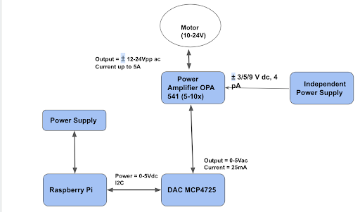
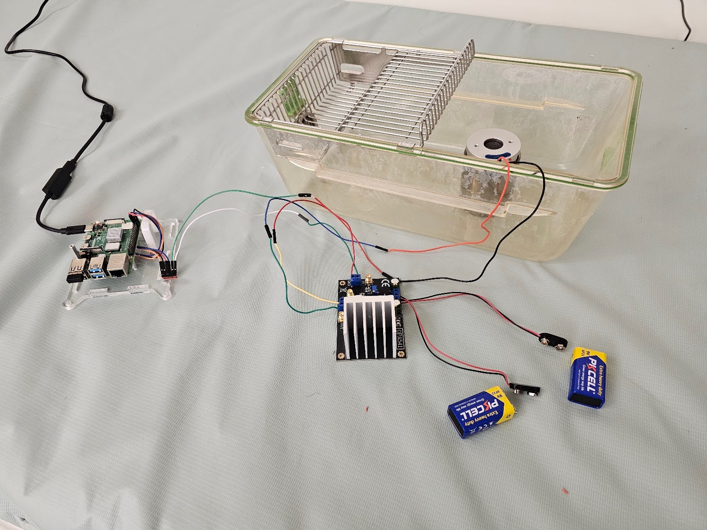

## Table of Contents
- [Installation](#installation)
- [Usage](#usage)

## Prerequisites
- Python 3.8 or higher

## Installation
- Controller Board: [Raspberry Pi 4 Model B Rev 1.4](https://www.raspberrypi.com/products/raspberry-pi-4-model-b/)
- Motor [60VC003](https://www.smoothmotor.com/video/products-detail-3207327)
- DAC Board [MCP4725](https://www.microchip.com/en-us/product/mcp4725)
- Power Amplifier [OPA541](https://www.ti.com/lit/ds/symlink/opa541.pdf?ts=1736251871643&ref_url=https%253A%252F%252Fwww.mouser.cn%252F)
- Independent [Power Supply] (https://a.co/d/hWlwYX6) 

## Usage

### To Install Required Python Packages

<!-- - If you reinstall operating system, then run following command to install all required packages before running the code.

`
sudo python3 -m pip install --break-system-packages -r requirements.txt
`

- After installing the packages, enable the I2C interface. Run sudo raspi-config. Then go to Interfacing Option, select I2C and enable it. Reboot with sudo reboot. After rebooting, run sudo i2cdetect -y 1, you should see some devices in the adress table.  -->
`
sudo chomd +x install.sh

./install.sh
`

### To Run Simulator Code

- To Run the simulator use the framework_heartsim_continous.py file and specify option.
- Option 0 is for arbitrary HR and RR combination, in this case specify HR and RR
- Option 1 to 5 are for the standard HR and RR combinations

### Example Usage

- For Option 0

You can specify any combination of heart rate (HR) and respiration rate (RR). Example: 

`
python3 heartsim.py --option 0 --hr 96 --rr 16
`

- For Options 1-5

You can choose specific HR and RR combination by using different options. Example: 

`
python3 heartsim.py --option 1
`
